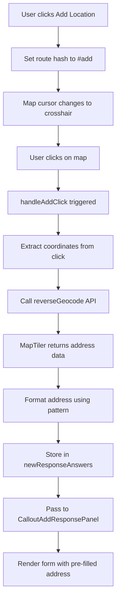

# MapTiler Integration in Frontend

## Overview

This document describes how MapTiler is integrated into the Beabee frontend application to provide interactive mapping capabilities and address geocoding functionality. The integration enables users to click on maps to add new locations and automatically retrieve formatted addresses for form submissions.

## Architecture

### Core Components

- **MapTiler Client**: `@maptiler/client` package for geocoding API calls
- **MapLibre GL JS**: Open-source mapping library for interactive maps
- **Vue Maplibre GL**: Vue.js wrapper components for MapLibre
- **Geocoding Control**: MapTiler's search control for address lookup

### Key Files

- `apps/frontend/src/lib/maptiler.ts` - MapTiler client configuration
- `apps/frontend/src/utils/geocode.ts` - Geocoding utility functions
- `apps/frontend/src/pages/crowdnewsroom/[id]/map.vue` - Main map component
- `apps/frontend/src/env.ts` - Environment configuration
- `apps/frontend/src/lib/formio/providers/address/MapTilerAddressProvider.ts` - Form.io address provider
- `apps/frontend/src/type/maptiler.ts` - MapTiler type definitions

## Configuration

### Environment Variables

The MapTiler integration requires the following environment variable:

```bash
BEABEE_MAPTILER_KEY=your_maptiler_api_key_here
```

This key is used for:

- Reverse geocoding (coordinates → address)
- Forward geocoding (address → coordinates)
- Map tile access
- Geocoding control functionality

### Client Setup

```typescript:apps/frontend/src/lib/maptiler.ts
import { config, geocoding } from '@maptiler/client';
import env from '../env';

config.apiKey = env.maptilerKey;
export { geocoding };
```

The API key is automatically configured when the module is imported, making the geocoding functions available throughout the application.

## Map Click to Address Flow

### 1. Add Mode Activation

Users activate add mode by clicking the "Add Location" button, which sets the route hash to `#add`:

```typescript
function handleStartAddMode() {
  router.push({ ...route, hash: "#add" });
}
```

When in add mode, the map cursor changes to a crosshair and users can click anywhere on the map to add a new location.

### 2. Map Click Handling

The `handleAddClick()` function processes map clicks in add mode:

```typescript:apps/frontend/src/pages/crowdnewsroom/[id]/map.vue
async function handleAddClick(event: MapMouseEvent) {
  const mapSchema = props.callout.responseViewSchema?.map;
  if (!map.value || !mapSchema) return;

  const coords = event.lngLat;

  // Center map on clicked location
  map.value.easeTo({
    center: coords,
    padding: { left: sidePanelRef.value?.offsetWidth || 0 },
  });

  // Get address from coordinates
  const geocodeResult = await reverseGeocode(coords.lat, coords.lng);

  // Create address object
  const address: GeocodeResult = {
    formatted_address: geocodeResult?.formatted_address || '???',
    features: geocodeResult?.features || [],
    geometry: {
      location: coords, // Use click location, not geocoded result
    },
  };

  // Store in response answers
  const responseAnswers: CalloutResponseAnswersSlide = {};
  setKey(responseAnswers, mapSchema.addressProp, address);

  // Add formatted address if pattern is configured
  if (mapSchema.addressPatternProp && geocodeResult) {
    const formattedAddress = formatGeocodeResult(
      geocodeResult,
      mapSchema.addressPattern
    );
    setKey(responseAnswers, mapSchema.addressPatternProp, formattedAddress);
  }

  newResponseAnswers.value = responseAnswers;
}
```

### 3. Reverse Geocoding

The `reverseGeocode()` function converts coordinates to address information:

```typescript:apps/frontend/src/utils/geocode.ts
export async function reverseGeocode(
  lat: number,
  lng: number
): Promise<GeocodeResult | undefined> {
  if (!env.maptilerKey) {
    return undefined;
  }

  const data = await geocoding.reverse([lng, lat], {
    language: currentLocaleConfig.value.baseLocale,
    types: ['address', 'postal_code', 'municipality', 'county', 'region'],
  });

  if (!data.features.length) {
    return undefined;
  }

  const result: GeocodeResult = {
    ...featureToAddress(data.features[0]),
    features: data.features.map((feature) => ({
      text: feature.text,
      types: feature.place_type,
    })),
  };

  // Add street number if available
  const addressFeature = data.features.find((f) =>
    f.place_type.includes('address')
  );

  if (addressFeature && addressFeature.address) {
    result.features.push({
      text: addressFeature.address,
      types: ['street_number'],
    });
  }

  return result;
}
```

### 4. Address Formatting

The `formatGeocodeResult()` function applies custom formatting patterns:

```typescript:apps/frontend/src/utils/geocode.ts
export function formatGeocodeResult(
  result: GeocodeResult,
  pattern: string
): string {
  return pattern.replace(/{([\w|]+)}/g, (_m, keys) => {
    for (const key of keys.split('|')) {
      const text = result.features.find((a) => a.types.includes(key))?.text;
      if (text) {
        return text;
      }
    }
    return '???';
  });
}
```

This allows administrators to configure custom address formats using placeholders like `{street_number}`, `{route}`, `{locality}`, etc.

### 5. Form Integration

The address data is stored in `newResponseAnswers` and passed to the `CalloutAddResponsePanel`:

```vue:apps/frontend/src/pages/crowdnewsroom/[id]/map.vue
<CalloutAddResponsePanel
  :callout="callout"
  :answers="newResponseAnswers"
  @close="handleCancelAddMode"
/>
```

The panel then renders the appropriate form components based on the callout's form schema, with the address data pre-populated.

## Address Provider Integration

### Form.io Address Provider

The MapTiler integration includes a complete Form.io address provider that can be used in forms:

```typescript
import { MapTilerAddressProvider } from "./MapTilerAddressProvider";

const provider = new MapTilerAddressProvider({
  params: {
    key: env.maptilerKey,
    language: currentLocaleConfig.value.baseLocale,
    country: ["DE", "AT", "CH"],
    limit: 10,
  },
});

// Search for addresses
const results = await provider.search("München Hauptbahnhof");

// Attach autocomplete to input fields
provider.attachAutocomplete(
  document.getElementById("address-input"),
  0,
  (place, elem, index) => {
    // Handle address selection
  },
);
```

The provider automatically transforms MapTiler responses to Google Maps format for compatibility with existing Form.io components.

### Provider Features

- **Address Search**: Forward geocoding with type filtering
- **Autocomplete**: Debounced input handling with result filtering
- **Response Transformation**: Google Maps compatible output format
- **Configuration**: Language, country, and type restrictions
- **Type Safety**: Full TypeScript support with proper interfaces

For detailed documentation, see [MapTiler Address Provider](./maptiler-provider.md).

## Geocoding Control

### Search Functionality

The map includes a geocoding control that allows users to search for addresses:

```typescript:apps/frontend/src/pages/crowdnewsroom/[id]/map.vue
if (env.maptilerKey) {
  const geocodeControl = new GeocodingControl({
    apiKey: env.maptilerKey,
    language: currentLocaleConfig.value.baseLocale,
    proximity: [{ type: 'map-center' }],
    country: props.callout.responseViewSchema?.map?.geocodeCountries,
  });

  // Handle address selection
  geocodeControl.addEventListener('pick', (e: Event) => {
    const event = e as GeocodePickEvent;
    geocodeAddress.value = event.detail
      ? featureToAddress(event.detail)
      : undefined;
  });

  mapInstance.addControl(geocodeControl, 'top-left');
}
```

### Address Selection

When a user selects an address from the search results, it's converted to the internal address format:

```typescript:apps/frontend/src/utils/geocode.ts
export function featureToAddress(
  feature: GeocodingFeature
): CalloutResponseAnswerAddress {
  return {
    formatted_address: feature.place_name,
    geometry: {
      location: { lat: feature.center[1], lng: feature.center[0] },
    },
  };
}
```

## Data Flow Diagram



## Configuration Options

### Map Schema Configuration

Callout administrators can configure various map settings:

- **Address Property**: Which form field stores the address data
- **Address Pattern Property**: Which field stores the formatted address
- **Address Pattern**: Custom formatting template (e.g., `{street_number} {route}`)
- **Geocode Countries**: Restrict search to specific countries
- **Map Style**: Custom MapTiler map style URL
- **Zoom Levels**: Min/max zoom constraints
- **Map Bounds**: Geographic boundaries

### Example Configuration

```typescript
mapSchema: {
  addressProp: 'slide1.address',
  addressPatternProp: 'slide1.formattedAddress',
  addressPattern: '{street_number} {route}, {locality}',
  geocodeCountries: ['DE', 'AT', 'CH'],
  style: 'https://api.maptiler.com/maps/streets/style.json?key=...',
  center: [13.4050, 52.5200], // Berlin
  initialZoom: 10,
  minZoom: 5,
  maxZoom: 18
}
```

## Error Handling

### Missing API Key

If no MapTiler API key is configured:

- Geocoding functions return `undefined`
- Geocoding control is not displayed
- Map functionality remains available but without address lookup

### Geocoding Failures

When reverse geocoding fails:

- Address is set to `'???'`
- Coordinates are still stored from the click location
- Form submission can proceed with manual address entry

## Performance Considerations

### API Rate Limits

- MapTiler has rate limits based on plan type
- Consider implementing caching for frequently requested coordinates
- Batch geocoding requests when possible

### Map Loading

- Map tiles are loaded on-demand
- Geocoding control is only initialized when API key is available
- Address data is fetched asynchronously to prevent UI blocking

## Security Considerations

### API Key Protection

- API key is stored in environment variables
- Frontend key is public but can be restricted by domain
- Consider implementing server-side geocoding for sensitive applications

### Data Privacy

- User click coordinates are processed locally
- Address data is sent to MapTiler for geocoding
- No personal information is transmitted to MapTiler

## Troubleshooting

### Common Issues

1. **Maps not loading**: Check `BEABEE_MAPTILER_KEY` environment variable
2. **Geocoding not working**: Verify API key validity and rate limits
3. **Address format issues**: Check `addressPattern` configuration
4. **Search control missing**: Ensure API key is properly configured

### Debug Information

Enable browser developer tools to see:

- Network requests to MapTiler API
- Console errors from geocoding functions
- MapLibre GL JS debug information

## Future Enhancements

### Potential Improvements

- **Caching**: Implement local storage for geocoding results
- **Batch Processing**: Group multiple coordinate requests
- **Fallback Providers**: Support multiple geocoding services
- **Offline Support**: Cache map tiles for offline use
- **Custom Styling**: Allow per-callout map customization

### Integration Opportunities

- **Form Validation**: Real-time address validation
- **Autocomplete**: Address input with suggestions
- **Routing**: Calculate distances between locations
- **Analytics**: Track map usage and popular locations
